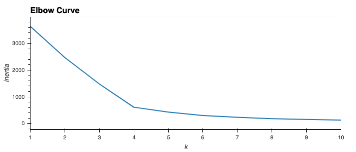
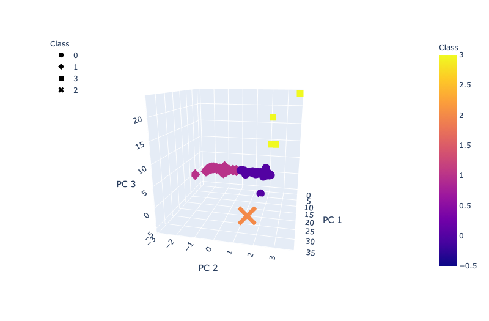
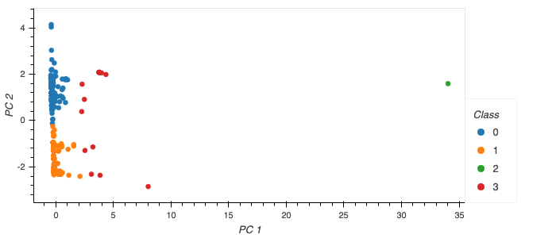
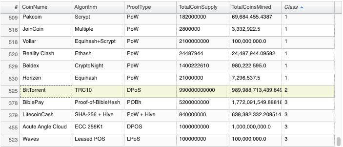
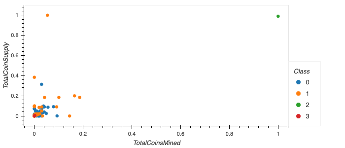

# Cryptocurrencies

## Overview
Using unsupervised machine learning to analyze a database of cryptocurrencies and create a report including the traded cryptocurrencies classified by group according to their features.

Analysis Methods:
- preprocessing the database,
- reducing the data dimension using Principal Component Analysis,
- clustering cryptocurrencies using K-Means,
- visualizing classification results with 2D and 3D scatter plots.

## Resources
- Data Source: [crypto_data.csv](https://github.com/zinashah8/cryptocurrencies/blob/f473ede47fafa1fbc20491a80d764c073f8a1586/Resources/crypto_data.csv), [CryptoCompare](https://min-api.cryptocompare.com/data/all/coinlist)
- Tech Used: Python, Anaconda Navigator, Conda, Jupyter Notebook

## Results
Following the preprocessing and cleaning phase we have a total of 532 tradable cryptocurrencies.

### Clustering Cryptocurrencies using K-Means - Elbow Curve
Unsupervised Machine Learning:

Produced the elbow curve below using the K-Means method iterating on k values from 1 to 10. 

The best k value appears to be 4 so we would conclude on an output of 4 clusters to categorize the crytocurrencies.

### Visualizing Cryptocurrencies Results
#### 3D-Scatter plot with clusters

This 3-D scatter plot was obtained using the PCA algorithm to reduce the crytocurrencies dimensions to three principal components.

#### 2D-Scatter plot with clusters

This 2-D scatter plot was obtained using the PCA algorithm to reduce the crytocurrencies dimensions to two principal components.

We can identify the outliers like the unique cryptocurrency in the class #2.

#### Tradable Cryptocurrencies Table

Most of the cryptocurrencies are part of class #0 and #1.
The snapshot above shows that BitTorrent is the only cryptocurrency in class #2.

#### 2D-Scatter plot with TotalCoinMined vs TotalCoinSupply

Plotting the scatter plot from two cryptocurrency features directly does not efficiently segregate the different classes. Then using the PCA algorithm is the right method for better visualizations.

## Summary
We have identified the classification of 532 cryptocurrencies based on similarities of their features.

Unique attributes of each group need to be analyzed to determined their performance and potential interest for the investment bank's clients.